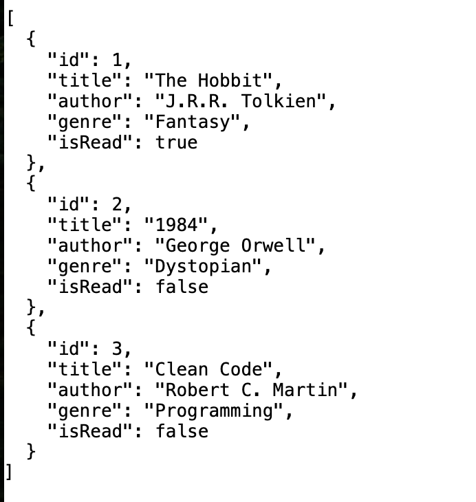
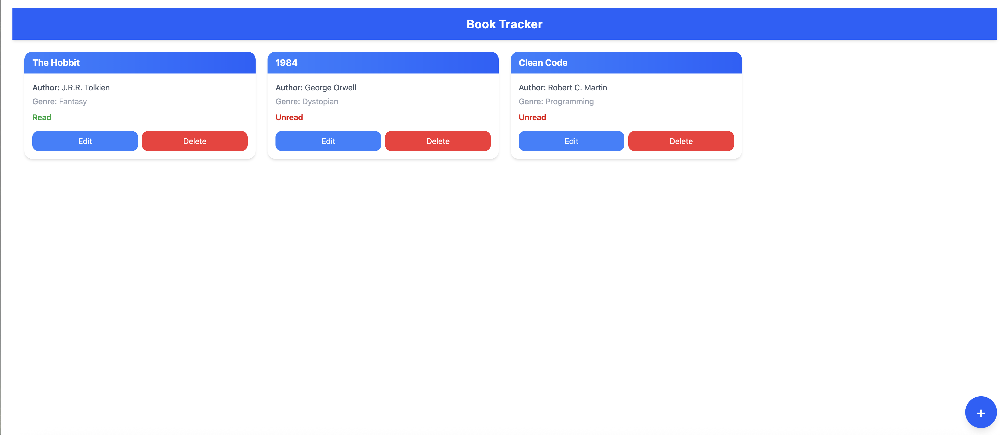
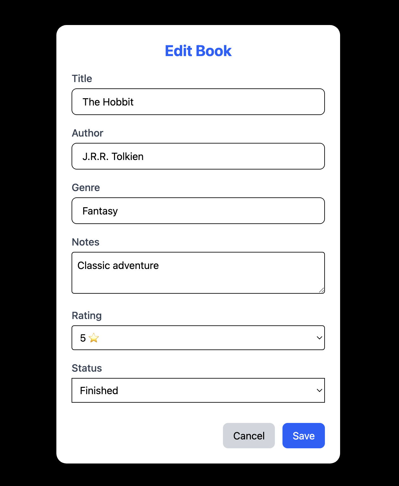

# BookTracker


A full-stack book tracker built with Vue 3, TypeScript, TailwindCSS for the frontend and C# / ASP.NET Core with SQLite for the backend. Track your books, mark them as read/unread, and manage your library easily.

## 🖥 Features

- Responsive book grid with TailwindCSS
- Read/Unread status for each book
- Edit/Delete books with buttons
- Floating Action Button (FAB) to add new books
- API-ready backend with SQLite + EF Core migrations
- Clean and modern UI

## 📸 Screenshots

### Backend


### Main Book Grid


### Edit Book


## ⚡ Tech Stack

**Frontend:**

- Vue 3 + TypeScript
- TailwindCSS
- Composition API

**Backend:**

- ASP.NET Core Web API
- Entity Framework Core
- SQLite

## 🚀 Getting Started

Backend
```bash
# Navigate to backend folder
cd backend

# Restore .NET packages
dotnet restore

# Apply EF Core migrations
dotnet ef database update

# Run backend API
dotnet run
```
Default API URL: https://localhost:5001/api/books

Frontend
```bash
# Navigate to frontend folder
cd frontend

# Install dependencies
bun install

# Run dev server
bun run dev
```
Visit http://localhost:5173 (or your terminal output) to see the app.

## 📌 Notes

- Commit EF Core migration scripts but do not commit the SQLite database file
- Make sure to configure CORS if frontend and backend run on different ports
