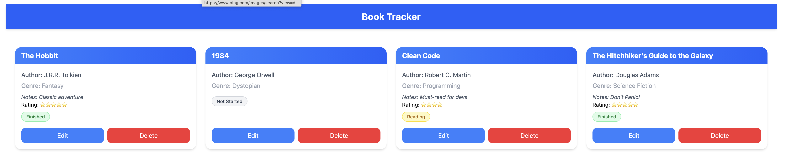

# Book Tracker App


A full-stack .NET 9 application with Vue for managing book items. The application follows the controller/service/repository pattern, utilizing Entity Framework Core for persistence, and includes a comprehensive test suite.

## 🖥 Features

- Add Book Items: Create new book items with title, author, genre, notes, rating, and status
- List Book Items: View all book items
- Edit Books Items: Update existing book items
- Delete Book Items: Remove book items
- Data Persistence: All data is persisted to a SQLite database using EF Core
- Seeded Data: Application starts with 3 pre-loaded book items

## Screenshots

### Backend


### Main Book Grid


### Edit Book


## Tech Stack

- .NET 9
- ASP.NET Core Web API / MVC
- Entity Framework Core 9.0
- SQLite Database
- xUnit for Testing
- Vue 3 + TypeScript
- TailwindCSS for Styling

## Getting Started

Frontend
```bash
# Navigate to frontend folder
cd frontend

# Install dependencies
bun install

# Build
bun run build
```

Backend
```bash
# Navigate to backend folder
cd backend

# Restore .NET packages
dotnet restore

# Apply EF Core migrations
dotnet ef database update

# Run backend API
dotnet run
```
Default API URL: https://localhost:5001/api/books

Visit http://localhost:5173 (or your terminal output) to see the app.

## API Endpoints

The application exposes REST API endpoints:

The application exposes REST API endpoints:

- `GET /api/books` - Get all book items
- `GET /api/books/{id}` - Get book item by ID
- `POST /api/books` - Create new book item
- `PUT /api/books/{id}` - Update book item
- `DELETE /api/books/{id}` - Delete book item

## Notes

- Commit EF Core migration scripts but do not commit the SQLite database file
- The database will be automatically created with seeded data on the first run
